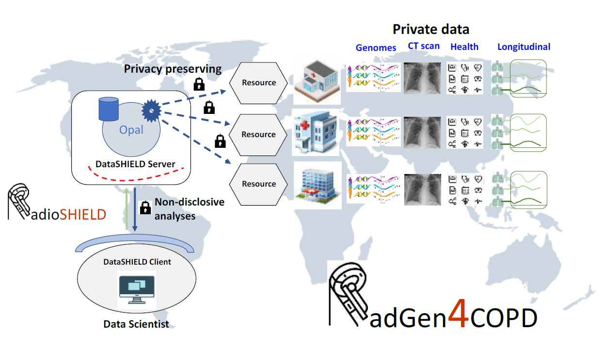

# RadGen4COPD: Radiogenomics for personalized medicine in chronic obstructive pulmonary disease

Radiogenomics combines a large volume of quantitative data extracted from medical images with individual genomes. It is been used in
neurological and cancer research. However, there is a lack of studies of other common diseases with a heavy imaging component. It is
largely unknown, for instance, the genetic basis of imaging biomarkers of lung diseases such as chronic obstructive pulmonary disease
(COPD) which is expected to become the leading cause of death globally by 2030.

One of the main reasons is that each genetic variant may have only a small contribution to disease risk being difficult to be detected in
small studies. Sharing data across cohorts provides an excellent strategy to overcome this limitation. However, there are important
constraints in the sharing of clinically sensitive data including patients privacy protection and technical barriers such as the lack of
analytical platforms. RadGen4COPD aim to overcome this existing gap by making pioneering progress in creating a FAIR, robust, scalable
and privacy-protected radiogenomic data analysis tool.

RadGen4COPD's first objective is to provide an open-source, GDPR compliance technical solution to be used in Health. 
In particular, we aim to translate radiogenomics into precision respiratory medicine through facilitating federated analyses. 
To this end, we will implement our infrastructure (`RadioSHIELD`) to analyse data from a large 
consortium having multi-level (clinical, functional, imaging and molecular) profiling of well-characterized patients with COPD.

## RadioSHIELD Structure

The `RadioSHIELD`  ecosystem comprises several components designed to work in conjunction or standalone using 
[DataSHIELD](https://www.datashield.org/about/about-datashield-collated) environment. These include next DataSHIELD libraries to integrate 
different types o data you can manage at each server

- [`dsOmics`](https://github.com/isglobal-brge/dsOmics): This package provides a collection of functions designed for the non-disclosive analysis of Omics data within the DataSHIELD environment, leveraging the Bioconductor project's resources. It enables the integration and analysis of genomic data in a secure manner.
- [`dsImaging`](https://github.com/isglobal-brge/dsImaging): This package provides a set of functions to interact with medical images in various formats. It integrates the application of segmentation filters (masks) on images and the application of analysis models, including feature extraction through radiomics and computer vision-trained models.
- [`dsOMOP`](https://github.com/isglobal-brge/dsOMOP): This package facilitates interaction with remote databases in the OMOP CDM format from a DataSHIELD environment. It is responsible for fetching and transforming data from databases into a user-intelligible table format, integrated into the DataSHIELD workflow to ensure compliance with the DataSHIELD security model.

Other developments include specific libraries to do some tasks required for personalized medicine in federated systems such as

- [`dsFDL`](https://github.com/isglobal-brge/dsFDL): **Currently under development.** This package enables the training of AI models within federated environments using DataSHIELD. It is designed to facilitate the development and deployment of machine learning algorithms in a secure and privacy-preserving manner.
